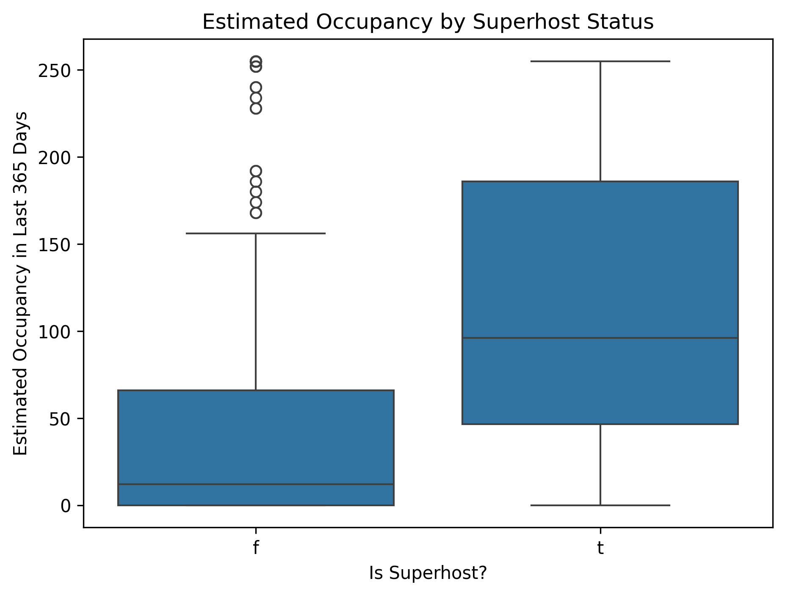
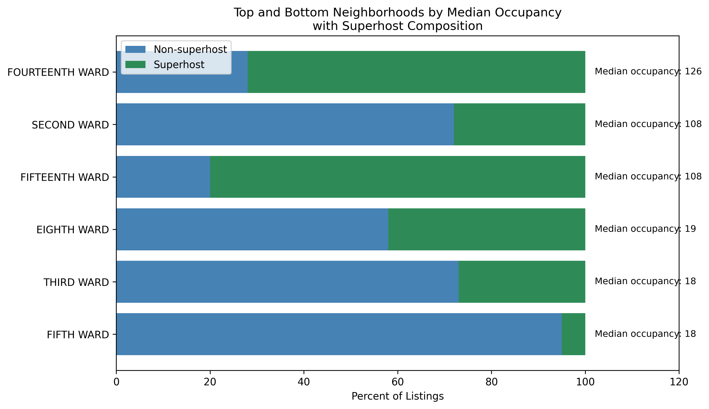
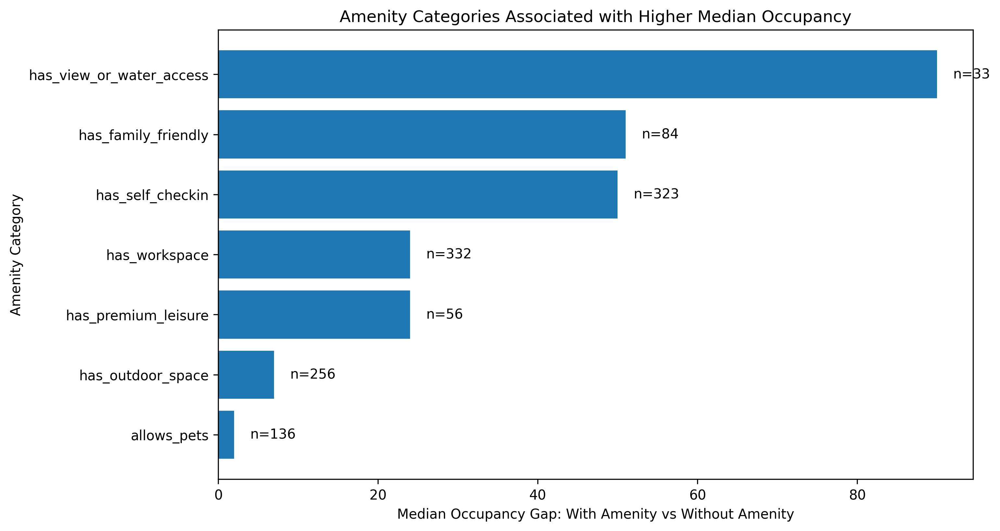
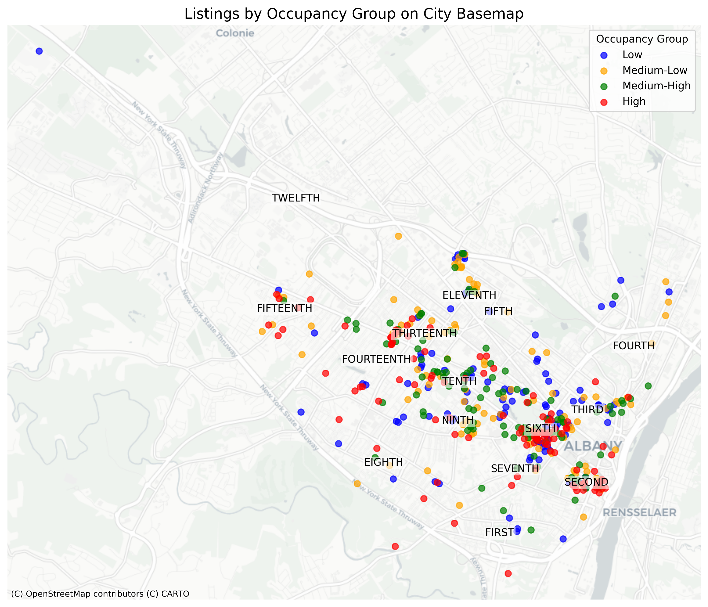

# 🏘️Airbnb Occupancy & Market Analysis — Albany, NY

## Python Data Analysis | Exploratory Data Analysis | Statistical Testing | Geospatial Analysis

> What drives Airbnb occupancy?
An analysis of 453 Airbnb listings in Albany, NY to identify the host, neighborhood, property, and amenity characteristics associated with stronger estimated occupancy.

## 🔎 At a Glance
| **453** | **15** | **13** | **6+** |
|:---:|:---:|:---:|:---:|
| Listings analyzed | Neighborhoods | Amenity features | Analytical techniques |
## 🎯 Business Objective
Translate listing-level data into actionable insights for Airbnb hosts and prospective investors evaluating demand and listing performance.

## Key Questions
+ 🏆 Host performance — Is Superhost status associated with higher occupancy?
+ 📍 Location — Which Albany neighborhoods have the strongest typical occupancy?
+ 🛎️ Amenities — Which amenities are associated with higher occupancy?
+ 🏠 Property type — Does the type of accommodation meaningfully affect performance?
+ 🗺️ Geography — Are there identifiable geographic patterns in listing occupancy?
+ ⚠️ How to Interpret the Results

The analysis identifies associations within the dataset, not causal relationships. Higher occupancy among listings with a particular characteristic does not necessarily mean that characteristic directly causes higher demand.

## 📊 Key Findings
## 1. Superhost Status Is Strongly Associated With Higher Occupancy

|  | Non-Superhost	| Superhost |
|---|---:|---:|
| Listings |	241 | 212 |
| Mean occupancy	| 49.7 days	| 113.7 days |
| Median occupancy | 12 days	| 96 days |

**Statistical test:** Welch's t-test · t = 8.62 · p < 0.001

**Takeaway:** Superhost listings had substantially higher estimated occupancy and more consistent performance.


## 2. Occupancy Varies Significantly Across Neighborhoods

Highest median estimated occupancy:

| Rank |	Neighborhood	| Median occupancy |
|:---:|:---:|:---:|
| 🥇 |	Fourteenth Ward |	126 days |
| 🥈 |	Fifteenth Ward	| 108 days |
| 🥈 |	Second Ward	| 108 days |

**Notable:** Second Ward achieved high occupancy despite having only a **28% Superhost rate**, suggesting factors beyond Superhost status may contribute to demand.



## 3. Certain Amenities Are Associated With Large Occupancy Differences

| Amenity	| Median occupancy gap |
|:---:|:---:|
| View / water access	| +90 days |
| Family-friendly features | +51 days |
| Self check-in	| +50 days |
| Premium leisure features	| +24 days |
| Workspace	| +24 days |

**Takeaway:** Practical features such as self check-in and family-friendly amenities showed meaningful occupancy differences across a larger number of listings.

**Note:** View/water access showed the largest difference but was available in only 33 listings.



## 🏠 What Else Did the Analysis Show?
+ Entire-place listings represented ~75% of the dataset and had the highest median occupancy.
+ Property type alone did not explain neighborhood-level performance.
+ Sixth Ward had the most listings but a lower median occupancy than the top-performing neighborhoods.
+ Geographic analysis showed no single city-wide pattern explaining occupancy.
+ High-performing neighborhoods differed in their Superhost composition, suggesting location and host performance should be evaluated together.





 ## 💡 Business Takeaways

### For Airbnb hosts

Prioritize service standards associated with Superhost performance.
Consider self check-in and family-friendly features where appropriate.
Evaluate amenities based on their potential to differentiate a listing.

### For prospective investors

Compare neighborhood demand, not just property characteristics.
Consider both occupancy potential and competitive density.
Do not rely on property type alone when evaluating a listing.

## 🔬 Methodology

### Data Preparation

+ Cleaned and validated Airbnb listing data
+ Standardized categorical variables
+ Handled missing values and prepared analysis-ready data

### Feature Engineering

+ Created 13 amenity-level features from listing amenity data
+ Derived occupancy, host, property, and neighborhood metrics

### Analysis

+ Exploratory data analysis
+ Grouped comparisons
+ Median and mean analysis
+ Welch's t-test
+ Correlation analysis
+ Geospatial visualization

### ⚠️ Limitations

+ Results show association, not causation
+ Revenue and pricing data were unavailable
+ Some amenity categories had small sample sizes
+ Amenity categories were manually classified
+ Geographic boundaries were approximated
+ Seasonality, events, pricing strategy, listing quality, and other market factors were not captured

### 🛠️ Tools

Python · Pandas · NumPy · SciPy · Matplotlib · Seaborn · GeoPandas · Contextily · Jupyter Notebook

## 📁 Repository
```text
Capstone/
├── Data/
│   ├── Raw/
│   └── Processed/
├── Docs/
├── Notebooks/
│   └── Analysis.ipynb
├── Outputs/
│   └── Figures/
├── Airbnb_Capstone_Summary_Presentation.pptx
├── README.md
└── requirements.txt
```

## 📓 Explore the Analysis

View the full Jupyter Notebook

The notebook contains the complete data-cleaning process, feature engineering, statistical analysis, visualizations, and supporting calculations.
